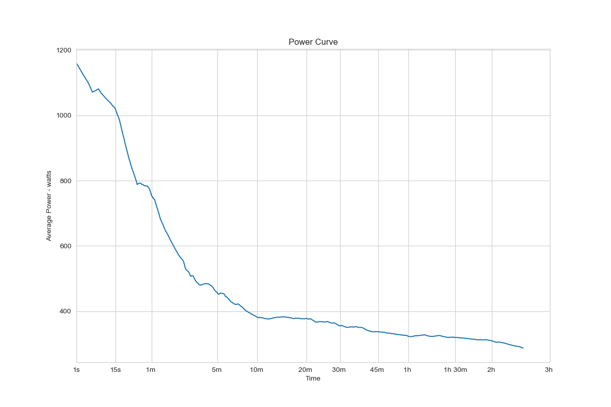

# power-curve

# initial edits

EJ Wong: 
I have added a source code that calculates a running average across a selected timeframe and a second algorithm that runs the greatest average output over a specific timeframe. The second algoritm is similar to Kadane's Algorithm but uses an maximum average subarray of size n compared to just a max subarray.

Please see [`codeWong.py`](src/codeWong.py). 

Reproducable code can be done here:

```
make wong
```

See more on Kadane's Algorithm: https://en.wikipedia.org/wiki/Maximum_subarray_problem

Camden Black Ingersoll:

I included a dynamic programming approach for finding best efforts. It uses the cumulative sums from a previous iteration to calculate the current sums more quickly. This requires fewer calculations as the time interval increases.

<p>
To reproduce, paste ride.gpx file in the data directory.
</p>

Parse the gpx file:
```
make parse
```
Calculate best efforts and create power curve figure:
```
make best-power
```
We can add timers to compare different approaches:
```
Time to calculate best efforts:  4.82058475
```
<p>This will generate a power curve with a linear x scale:</p>



<p>
We can optimize this further by only calculating the relevant best efforts for 5, 10, 15 seconds, 1 min, 5 min, 10 min, etc... Strava uses an x scale with progressive intervals: the spacing between x ticks is 1 second for 0 to 1 minute efforts, and 5 minutes for efforts over 3 hours.
</p>